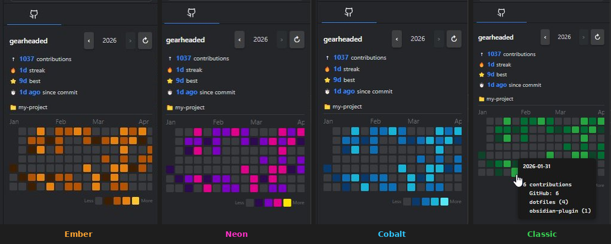
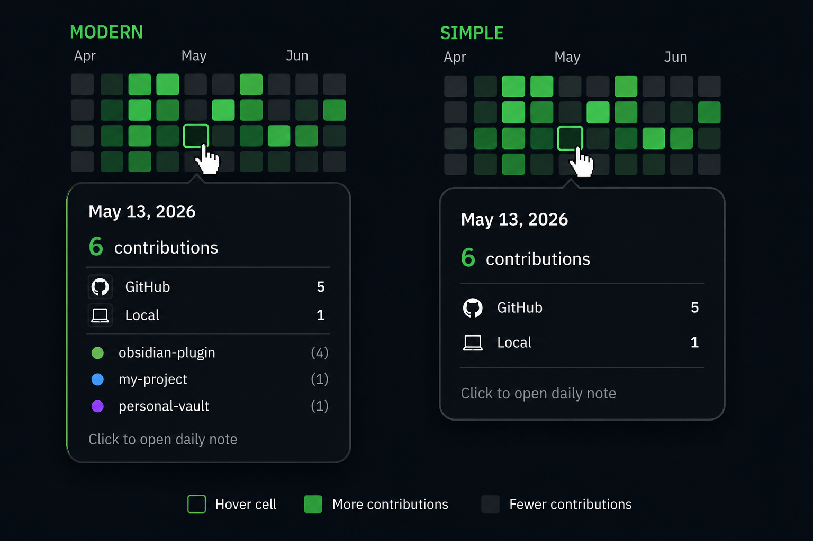
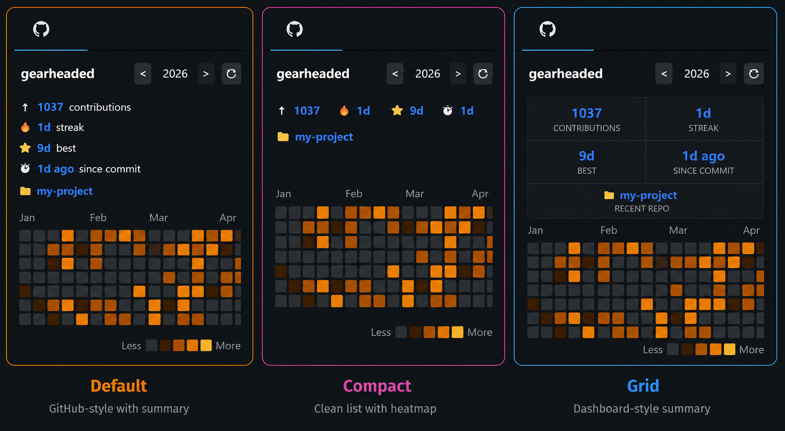
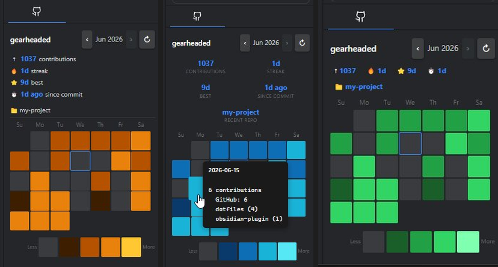
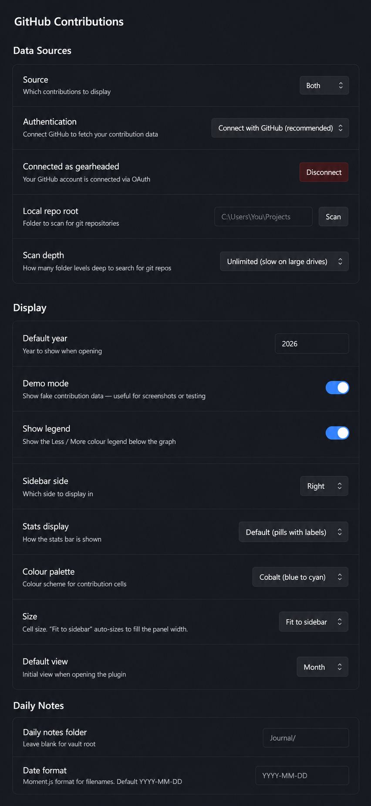

# GitHub Contributions for Obsidian

View GitHub and local Git contributions directly in the Obsidian sidebar - complete with streak tracking, per-repo tooltips, color palettes, and one-click daily note creation.



## Features

- **Contribution heatmap** - full year or month view, dark/light theme aware
- **Local Git support** - include contributions from repositories that never leave your machine
- **OAuth authentication** - connect GitHub with one click, no token copying required
- **Year and month navigation** - flip back through any year since 2008, or browse month by month
- **Stats bar** - total contributions, current streak, best streak, days since last commit, most recent repo
- **Hover tooltips** - date, total count, and per-repo breakdown on every cell



- **Click to open daily note** - clicking any day opens (or creates) the matching daily note
- **Five colour palettes** - Classic (GitHub greens), High Contrast, Cobalt (blue/cyan), Neon (purple/yellow), Ember (amber/gold)
- **Three stats styles** - Default list, Compact chips, or Grid



- **Year and month views** - navigate the full year or zoom into a single month



- **Configurable size** - Ultra compact, Compact, Medium, Large, or Fit to sidebar
- **Demo mode** - generates realistic fake data for screenshots or testing
- **Mobile friendly** - GitHub contributions work on mobile; local Git gracefully disabled

## Installation

### Community Plugin Registry (recommended)

1. Open Obsidian -> **Settings -> Community Plugins -> Browse**
2. Search for **GitHub Contributions**
3. Click **Install**, then **Enable**
4. Open plugin settings and click **Connect GitHub**

### Manual

1. Download `main.js` and `manifest.json` from the latest release
2. Copy both files into your vault's plugin directory:
   ```
   <YourVault>/.obsidian/plugins/github-contributions/
   ```
3. In Obsidian -> **Settings -> Community Plugins**, enable **GitHub Contributions**

## Connecting GitHub

The recommended way is OAuth - no token copying required:

1. Open plugin settings
2. Under **Authentication**, select **Connect with GitHub (recommended)**
3. Click **Connect GitHub**
4. A code appears in the settings panel - enter it at **github.com/login/device**
5. Approve in your browser - the plugin connects automatically

### Personal Access Token (advanced)

If you prefer a PAT, switch Authentication to **Personal Access Token** and enter:
- Your GitHub username
- A PAT from [github.com/settings/tokens](https://github.com/settings/tokens) with only the `read:user` scope

The token is stored locally in your vault and never leaves your machine except to call the GitHub GraphQL API. See the [Privacy](#privacy) section for more information.

## Local Git Support

To include commits from local repositories:

1. Set **Source** to **Local git only** or **Both**
2. Set **Local repo root** to a folder containing your git repos (e.g. `C:\Users\You\Projects`)
3. Click **Scan** - the plugin finds all git repos automatically up to the configured depth

Local Git mode only runs `git log` locally - no data is sent anywhere.

## Opening the panel

- Click the **GitHub icon** in the ribbon
- Or run the command palette: `GitHub Contributions: Open GitHub Contributions panel`
- On mobile: use the command palette (swipe down or tap the search icon)

## Daily note integration

Clicking any contribution cell opens the matching daily note. If it doesn't exist yet then it will be created automatically. Works alongside the core Daily Notes and Periodic Notes plugins - just make sure the folder and date format match.

## Settings reference



### Data Sources
| Setting | Description |
|---|---|
| Source | GitHub only, Local git only, or Both |
| Authentication | OAuth (recommended) or Personal Access Token |
| Local repo root | Root folder to scan for git repositories |
| Scan depth | How many levels deep to search (2–5, or unlimited) |

### Display
| Setting | Description |
|---|---|
| Sidebar side | Left or right panel |
| Stats display | Default list, Compact chips, or Grid |
| Colour palette | Classic, High Contrast, Cobalt, Neon, or Ember |
| Size | Ultra compact, Compact, Medium, Large, or Fit to sidebar |
| Default view | Year or Month |
| Default year | Year shown on first open |
| Demo mode | Show fake data for screenshots or testing |
| Show legend | Show or hide the Less / More colour legend |

### Daily Notes
| Setting | Description |
|---|---|
| Daily notes folder | Folder to look for / create daily notes (blank = vault root) |
| Date format | Moment.js format matching your filenames (default: `YYYY-MM-DD`) |

## Privacy

- **GitHub OAuth token** - stored locally, only used to call the GitHub GraphQL API
- **Local Git mode** - only runs `git log` locally, reads commit metadata only, no data sent anywhere
- No analytics, tracking, or telemetry

## Building from source

```bash
git clone https://github.com/gearheaded/obsidian-github-contributions
cd obsidian-github-contributions
npm install
npm run build
```

For live development with auto-rebuild on save:
```bash
npm run dev
```

## License

MIT